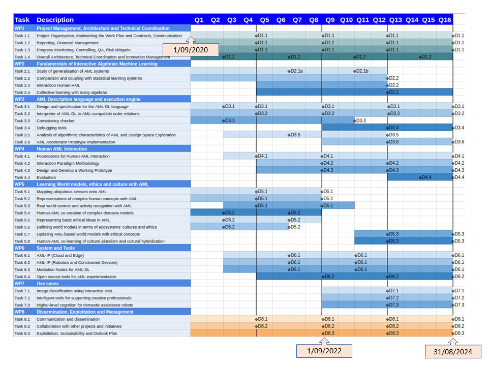

# ALMA

- ALMA: Human Centric Algebraic Machine Learning
- Grant agreement ID: 952091
- <https://cordis.europa.eu/project/id/952091>

## Public Repositories

- Algebraic Machine Learning (AML) applied algorithms: https://github.com/roboticslab-uc3m/alma-aml
- Robotic environments for applying AML algorithms: https://github.com/roboticslab-uc3m/gymnasium-alma
- Baseline deep neural network for comparison on robotic folding: https://github.com/roboticslab-uc3m/alma-dnn
- Dataset generator to train AML algorithm for robotic folding: https://github.com/roboticslab-uc3m/alma-dataset
    - Generated dataset: https://doi.org/10.5281/zenodo.14864392
 
## Publications

- Stephen Fox and Juan G. Victores. Safety of human–artificial intelligence systems: Applying safety science to analyze loopholes in interactions between human organizations, artificial intelligence, and individual people. Informatics, 2024. doi: 10.3390/informatics11020036. URL <https://doi.org/10.3390/informatics11020036> (Q2)
- Juan G. Victores et Al. Algebraic Machine Learning for Robotic Garment Folding/Unfolding. Simposio CEA de Robótica, Bioingeniería, Visión Artificial y Automática Marina, 2025. (Upcoming)

## Relevant Documentation and Link to Google Drive

- [Google Drive ALMA Project Shared Folder](https://drive.google.com/drive/folders/12gVnLVBIIaBld_8TJTCjapbNA4UfWHXt)

## More Practical Links

- [Developer Manual @ roboticslab-uc3m](https://robots.uc3m.es/developer-manual)
- <https://apps-robots.uc3m.es/robots/wiki/Llegar_al_Parque>

## Deliverables (UC3M)

- D7.5 (WP7) - Design of the benchmark tested for robotized ironing and garment folding - Initial - Demonstrator - Public - M36 (08/23)
- D7.6 (WP7) - Design of the benchmark tested for robotized ironing and garment folding - Final - Demonstrator - Public - M48 (08/24)

## GANTT

M1    |M2    |M3    |M4    |M5    |M6    |M7    |M8    |M9    |M10   |M11   |M12   |
------|------|------|------|------|------|------|------|------|------|------|------|
09/20 |10/20 |11/20 |12/20 |01/21 |02/21 |03/21 |04/21 |05/21 |06/21 |07/21 |08/21 |

M13   |M14   |M15   |M16   |M17   |M18   |M19   |M20   |M21   |M22   |M23   |M24   |
------|------|------|------|------|------|------|------|------|------|------|------|
09/21 |10/21 |11/21 |12/21 |01/22 |02/22 |03/22 |04/22 |05/22 |06/22 |07/22 |08/22 |

M25   |M26   |M27   |M28   |M29   |M30   |M31   |M32   |M33   |M34   |M35   |M36   |
------|------|------|------|------|------|------|------|------|------|------|------|
09/22 |10/22 |11/22 |12/22 |01/23 |02/23 |03/23 |04/23 |05/23 |06/23 |07/23 |08/23 |

M37   |M38   |M39   |M40   |M41   |M42   |M43   |M44   |M45   |M46   |M47   |M48   |
------|------|------|------|------|------|------|------|------|------|------|------|
09/23 |10/23 |11/23 |12/23 |01/24 |02/24 |03/24 |04/24 |05/24 |06/24 |07/24 |08/24 |

